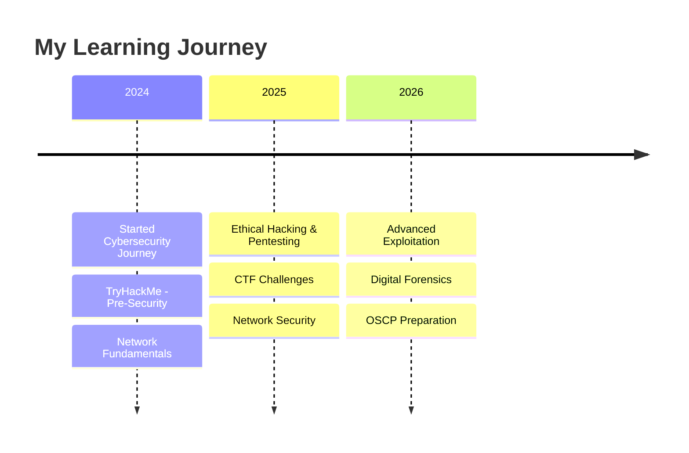

  

---

  
# 👋 Hi there, I'm Ahmad

### 🛡️ Cybersecurity Student | Ethical Hacker in Training | CTF Enthusiast

---

## 📖 About Me
🎓 **2nd-year Cybersecurity Student** at **Birzeit University**, Palestine  
💻 Passionate about **network security**, **ethical hacking**, and **CTF challenges**  
📚 Sharing my learning journey – tools I discover, labs I break, and skills I'm building  
🌱 Currently exploring **penetration testing** and **digital forensics**

---

## 🛠️ My Toolbox

| Category | Tools |
|----------|-------|
| 🐧 **Operating Systems** |    |
| 💻 **Languages** |     |
| 🔐 **Security Platforms** |   |
| 🛡️ **Security Tools** |     |
| 📦 **Other** |   |

---

## 📚 Currently Learning

- 🔥 **Network security** & **ethical hacking** fundamentals
- ⚔️ **CTF challenges** – building practical skills
- 🔍 **Penetration testing** methodologies
- 📡 **Digital forensics** & incident response

---

## 📊 GitHub Stats

<!-- Stats Card -->

 

<!-- Streak Stats -->

 

<!-- Top Languages -->

---

## 🎯 My Projects

| Project | Description |
|---------|-------------|
| 🔐 **[AES Encryption Project](https://github.com/A7mad-PSE/AES-Encryption-Project)** | Java implementation of AES with multiple cipher modes (ECB, CFB, OFB) + email integration |
| 🌐 **[TCP vs UDP Comparison](https://github.com/A7mad-PSE/TCP-vs-UDP)** | Python client-server applications demonstrating TCP vs UDP differences |
| 🛡️ **[Coming Soon...]** | Something exciting in the works! |

---

## 📫 Reach Me

---

## 💬 Random Cybersecurity Quote

> *"The only secure computer is one that's unplugged, locked in a vault, and buried 20 feet under the ground."*  
> — **Gene Spafford**

---

### 🚀 *"Keep learning, keep hacking, stay curious!"*

---

## 📝 Note

This README is a work in progress – I update it as I learn and grow in my cybersecurity journey. Feel free to connect or reach out!

---

⭐ **If you like what you see, consider following me!** ⭐
