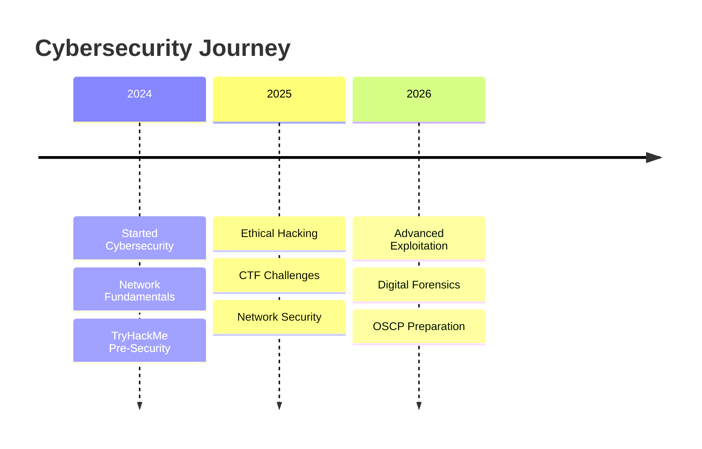

  

<h1 align="center">Hi 👋, I'm Ahmad</h1>

<h3 align="center">
🛡️ Cybersecurity Student • Ethical Hacker in Training • CTF Enthusiast
</h3>

  

  

  

  

  

---

# 📖 About Me

🎓 Second-year **Cybersecurity Student** at **Birzeit University**

💻 Passionate about:

- 🛡️ Cybersecurity
- 🌐 Network Security
- ⚔️ Ethical Hacking
- 🚩 CTF Competitions
- 🔍 Digital Forensics

📚 I enjoy documenting everything I learn and building practical security projects.

🌱 Currently learning:

- Penetration Testing
- Network Security
- Digital Forensics
- Python Automation
- Enterprise Networking

---

# 🛠️ My Toolbox

| Category | Technologies |
|----------|--------------|
| 🐧 Operating Systems |    |
| 💻 Languages |     |
| 🔐 Platforms |   |
| 🛡️ Security Tools |     |
| ⚙️ Other |   |

---

# 📚 Learning Journey

## 🎯 Current Focus

- 🌐 Network Security
- 🔍 Penetration Testing
- ⚔️ CTF Challenges
- 📡 Digital Forensics
- 🏗️ Enterprise Networking
- 🐍 Python Security Tools

---

# 🚀 Featured Projects

| Project | Description |
|---------|-------------|
| 🔐 AES Encryption | Java implementation supporting ECB, CFB and OFB with Email integration |
| 🌐 TCP vs UDP | Python client/server comparison of TCP and UDP |
| 🔍 Network Scanner | Python scanner with Ping Sweep, Port Scanner and OS Detection |
| 🏗️ Enterprise Network | Cisco Packet Tracer project using VLSM, DHCP, DNS, HTTP and Email |
| 🛡️ More Coming Soon | More cybersecurity projects are on the way! |

---

# 📈 Contribution Graph

---

# 📊 GitHub Statistics

---

# 📫 Connect With Me

---

# 💬 Favorite Quote

> "The only secure computer is one that's unplugged, locked in a vault, and buried 20 feet under the ground."
>
> **— Gene Spafford**

---

🚀 **Keep learning. Keep hacking. Stay curious.**

  

---

## 📝 Note

This profile is continuously updated as I learn new technologies, solve CTFs, complete labs, and build cybersecurity projects. Thanks for stopping by!
